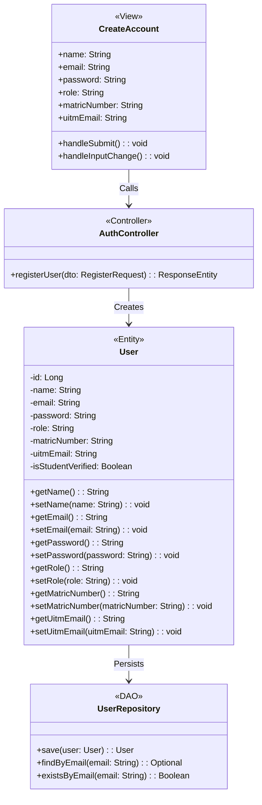

# Create Account Use Case Detail Class Diagram

Below is the **Detail Class Diagram** specifically for the **Create Account** use case of the **RakanSewa** system. It models the attributes, operations, and stereotype boundaries of the MVC architectural flow.

## 1. Mermaid Class Diagram

---

## 2. Interaction Descriptions

1. **`CreateAccount` (View)**: The registration screen collects student/owner input details (Name, Email, Password, Matric Number, and UiTM email) and triggers `handleSubmit()` to send an HTTP POST request to the API controller.
2. **`AuthController` (Controller)**: Receives the POST payload, validates the inputs, handles registration criteria, and instantiates a new `User` entity.
3. **`User` (Entity)**: Holds the state of the registered account attributes.
4. **`UserRepository` (DAO)**: Persists the newly created user object into the database through Spring Data JPA's `.save(user)` query.
