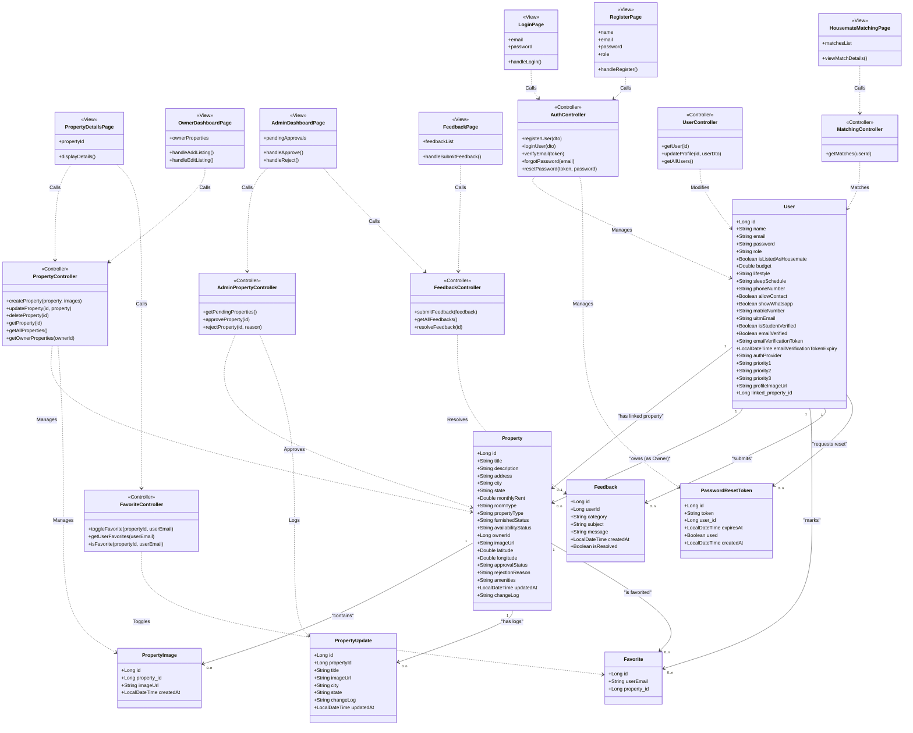

# Design Class Diagram - RakanSewa

Below is the **Design Class Diagram** for the **RakanSewa** system. It shows the architecture layout, mapping the frontend Views (`<<View>>`), backend REST Controllers (`<<Controller>>`), and persistence domain Entities, along with their association methods and calling relationships.

## 1. Mermaid Class Diagram

---

## 2. Structural Layer Descriptions

### A. View Layer (`<<View>>`)
These classes represent the user interface pages built with React and Tailwind CSS. They contain page states and handle user inputs (e.g., `handleLogin()`), then invoke Controller REST endpoints asynchronously via HTTP requests.

### B. Controller Layer (`<<Controller>>`)
These classes represent the Spring Boot `RestController` backend API mappings. They expose endpoints (e.g., `/api/properties`, `/api/auth`) and call Service/Repository components to execute operations on database entities.

### C. Domain Entity Layer
The persistent entity beans mapped to physical H2 database tables. They hold data columns, PK/FK attributes, and represent the system's core data models.
