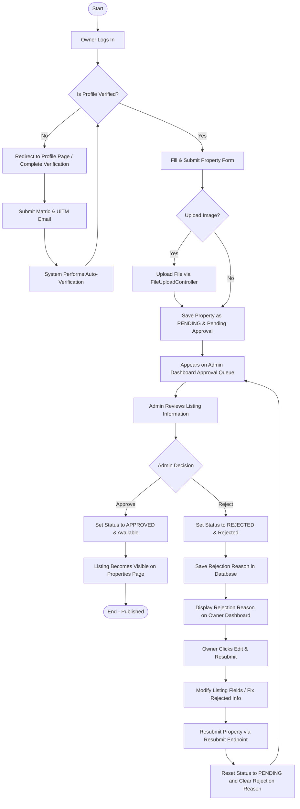
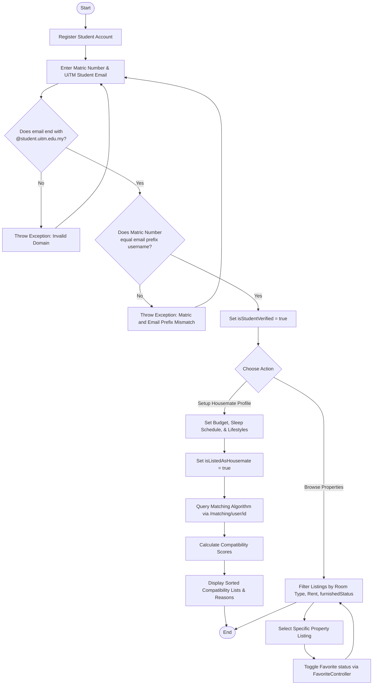

# RakanSewa Business Activity Diagrams

This document contains two main business activity flows representing the real business processes implemented in the RakanSewa system.

---

## 1. Property Listing Approval Lifecycle

This activity diagram shows the workflow from property registration by a Landlord/Owner to verification by the Admin, including correction and resubmission paths.

---

## 2. UiTM Student Verification & Housemate Matching Flow

This activity diagram describes the automated verification of Student status and how it feeds into the Housemate Listing, Matching Compatibility check, and Rental Booking requests.

