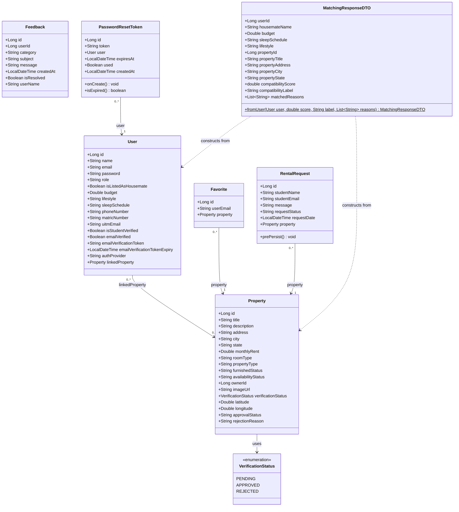

# RakanSewa Domain Class Diagram

This document contains the class diagram for the backend entities, enumerations, DTOs, and their relationships based directly on the Spring Boot database models.

## Domain Class Diagram

## Relationships Details

1. **User and Property (`linkedProperty`)**: A user (Student) can be linked to zero or one Property. A single Property can have multiple linked Users (housemates). This is mapped as a `@ManyToOne` association in `User.java`.
2. **Favorite and Property**: Many favorites can point to a single Property. A Favorite is identified by the user's email (`userEmail` as a field) and holds a `@ManyToOne` reference to `Property.java`.
3. **RentalRequest and Property**: A Property can receive multiple rental applications. Each `RentalRequest` is linked to exactly one `Property` via a `@ManyToOne` reference.
4. **PasswordResetToken and User**: Each reset token is associated with exactly one `User` via a `@ManyToOne` reference.
5. **Property and VerificationStatus**: Property has a field `verificationStatus` which is an Enum indicating whether the listing is `PENDING`, `APPROVED`, or `REJECTED`.
