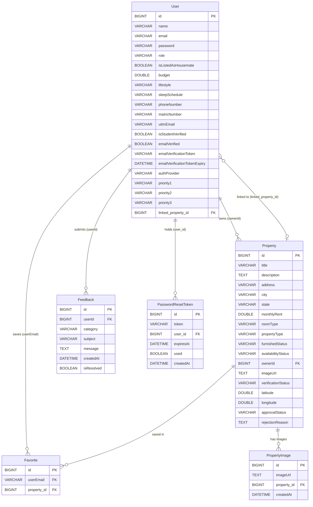

```mermaid
erDiagram
    User {
        BIGINT id PK
        VARCHAR name
        VARCHAR email
        VARCHAR password
        VARCHAR role
        BOOLEAN isListedAsHousemate
        DOUBLE budget
        VARCHAR lifestyle
        VARCHAR sleepSchedule
        VARCHAR phoneNumber
        VARCHAR matricNumber
        VARCHAR uitmEmail
        BOOLEAN isStudentVerified
        BOOLEAN emailVerified
        VARCHAR emailVerificationToken
        DATETIME emailVerificationTokenExpiry
        VARCHAR authProvider
        VARCHAR priority1
        VARCHAR priority2
        VARCHAR priority3
        BIGINT linked_property_id FK
    }

    Property {
        BIGINT id PK
        VARCHAR title
        TEXT description
        VARCHAR address
        VARCHAR city
        VARCHAR state
        DOUBLE monthlyRent
        VARCHAR roomType
        VARCHAR propertyType
        VARCHAR furnishedStatus
        VARCHAR availabilityStatus
        BIGINT ownerId FK
        TEXT imageUrl
        VARCHAR verificationStatus
        DOUBLE latitude
        DOUBLE longitude
        VARCHAR approvalStatus
        TEXT rejectionReason
    }

    PropertyImage {
        BIGINT id PK
        TEXT imageUrl
        BIGINT property_id FK
        DATETIME createdAt
    }

    Favorite {
        BIGINT id PK
        VARCHAR userEmail FK
        BIGINT property_id FK
    }

    Feedback {
        BIGINT id PK
        BIGINT userId FK
        VARCHAR category
        VARCHAR subject
        TEXT message
        DATETIME createdAt
        BOOLEAN isResolved
    }

    PasswordResetToken {
        BIGINT id PK
        VARCHAR token
        BIGINT user_id FK
        DATETIME expiresAt
        BOOLEAN used
        DATETIME createdAt
    }

    User ||--o{ Property : "owns (ownerId)"
    User }o--o| Property : "linked to (linked_property_id)"
    User ||--o{ Favorite : "saves (userEmail)"
    User ||--o{ Feedback : "submits (userId)"
    User ||--o{ PasswordResetToken : "holds (user_id)"
    Property ||--o{ Favorite : "saved in"
    Property ||--o{ PropertyImage : "has images"
```
