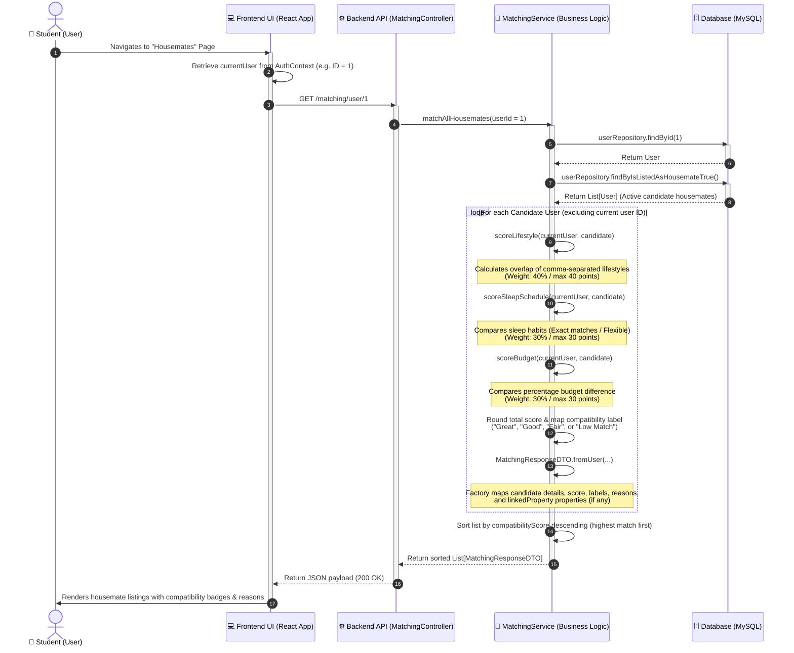

# RakanSewa System Sequence Diagram

This document contains the System Sequence Diagram representing the **Housemate Matching and Scoring Flow**, which is a core business operation of the RakanSewa platform.

## System Sequence Diagram: Housemate Matching & Compatibility Scoring

This diagram maps the interactions between the Student user, the React Frontend client, the Spring Boot Backend API, the Matching Service class, and the MySQL Database during matching evaluation.

## Detailed Interaction Walkthrough

1. **Trigger**: The Student user clicks the "Housemates" navigation menu item on the frontend.
2. **Context Retrieval**: The Frontend application retrieves the current user's authenticated ID from `AuthContext` to contextualize the matching request.
3. **Endpoint Call**: The frontend sends a GET request to `http://localhost:8080/matching/user/{userId}`.
4. **Service Delegation**: `MatchingController` delegates the core logic to `MatchingService.matchAllHousemates(userId)`.
5. **Database Fetching**:
   - `userRepository.findById(userId)` fetches the active user's preference record.
   - `userRepository.findByIsListedAsHousemateTrue()` retrieves all user profiles who opted to list themselves as potential housemates (`isListedAsHousemate = true`).
6. **Matching Evaluation**:
   - The service ignores the user's own profile.
   - Lifestyles are parsed (split by commas) and compared. The matching ratio determines up to **40 points**.
   - Sleep schedules are compared. Same schedules gain **30 points**, while flexible schedules gain **15 points**.
   - Budgets are compared using a percentage difference formula. Very close range earns **30 points**, descending to **10 points** for larger differences.
7. **DTO Generation**: Results are encapsulated into `MatchingResponseDTO` objects, enriching candidate housemate data with their respective matched property details (if linked to a property).
8. **Sorting & Response**: The final list is sorted in descending order (highest score first) and returned as a JSON array to the frontend.
9. **UI Render**: The React page receives the response and renders compatibility cards for each matching housemate.
