# RakanSewa System Use Case Diagram

This document contains the UML use case diagram for the RakanSewa system, representing the interactions between the actors and the system's core capabilities.

## Actors Identified
1. **Student (Renter / Housemate)**: Standard student user who looks for properties and compatible housemates. Must be verified through UiTM student credentials.
2. **Owner (Landlord)**: Property owner who lists rental properties and manages tenant requests.
3. **Admin**: System administrator who monitors users, manages approvals for listed properties, and resolves user feedbacks.

## Use Case Flowchart

```mermaid
graph TB
    %% Actors definition
    subgraph Actors
        Student["👤 Student (Renter/Housemate)"]
        Owner["👤 Owner (Landlord)"]
        Admin["👤 Admin"]
    end

    %% Use Cases subgraphs
    subgraph Authentication & Profile Use Cases
        UC1[Register & Login]
        UC2[Perform UiTM Student Verification]
        UC3[Manage User Profile]
    end

    subgraph Housemate Matching Use Cases
        UC4[Toggle Housemate Listing Status]
        UC5[Find Housemates & View Compatibility Score]
        UC6[Link / Unlink Selected Property]
    end

    subgraph Property Listings Use Cases
        UC7[Browse & Filter Approved Properties]
        UC8[Toggle Property Favorites]
        UC9[Submit Rental Request]
        UC10[Create Property Listing]
        UC11[Edit & Resubmit Property Listing]
        UC12[Delete Property Listing]
    end

    subgraph Management & Support Use Cases
        UC13[Submit Feedback / Report]
        UC14[Approve Property Listing]
        UC15[Reject Property Listing with Reason]
        UC16[View Users & Statistics]
        UC17[Resolve User Feedbacks]
        UC18[View Property Rental Requests]
        UC19[Approve/Reject Rental Request]
    end

    %% Student Relationships
    Student --> UC1
    Student --> UC2
    Student --> UC3
    Student --> UC4
    Student --> UC5
    Student --> UC6
    Student --> UC7
    Student --> UC8
    Student --> UC9
    Student --> UC13

    %% Owner Relationships
    Owner --> UC1
    Owner --> UC3
    Owner --> UC10
    Owner --> UC11
    Owner --> UC12
    Owner --> UC18
    Owner --> UC19

    %% Admin Relationships
    Admin --> UC1
    Admin --> UC14
    Admin --> UC15
    Admin --> UC16
    Admin --> UC17
```

## Description of Key Use Cases

| ID | Use Case Name | Actor(s) | Description |
|---|---|---|---|
| **UC1** | Register & Login | Student, Owner, Admin | Users authenticate into the system using standard email/password or Google OAuth (for Student auto-registration). |
| **UC2** | Perform UiTM Student Verification | Student | Compares matric number with student email prefix to auto-verify Student status. |
| **UC3** | Manage User Profile | Student, Owner | Allows updating user details, budget, sleep schedule, and lifestyle habits. |
| **UC4** | Toggle Housemate Listing Status | Student | Toggles `isListedAsHousemate` to list/unlist self in the housemates directory. |
| **UC5** | Find Housemates & View Compatibility | Student | Matches student against other listed housemates with compatibility percentages based on lifestyle, sleep, and budget. |
| **UC6** | Link / Unlink Selected Property | Student | Associates/dissociates a student's profile with a specific listed property. |
| **UC7** | Browse & Filter Approved Properties | Student | Searches and filters approved property listings by city, state, rent, room type, property type, and furnished status. |
| **UC8** | Toggle Property Favorites | Student | Saves/removes property listings to/from the student's favorites collection. |
| **UC9** | Submit Rental Request | Student | Sends a formal application/rental request for a property listing. |
| **UC10** | Create Property Listing | Owner | Creates a property listing (state initialized to `Pending` verification). |
| **UC11** | Edit & Resubmit Property Listing | Owner | Updates a listing. If previously rejected, editing resets approval status to `Pending` and clears the rejection reason. |
| **UC12** | Delete Property Listing | Owner | Deletes own property listings from the system. |
| **UC13** | Submit Feedback / Report | Student | Submits comments, suggestions, or reports with category, subject, and message. |
| **UC14**| Approve Property Listing | Admin | Verifies a pending property listing, updating status to `Approved` and making it visible. |
| **UC15**| Reject Property Listing with Reason | Admin | Rejects a pending property listing, specifying reasons for rejection. |
| **UC16**| View Users & Statistics | Admin | Views metrics including total users, total listings, pending approvals, and all user details. |
| **UC17**| Resolve User Feedbacks | Admin | Reviews submitted user feedbacks and marks reports or suggestions as resolved. |
| **UC18**| View Property Rental Requests | Owner | Views all incoming rental applications sent by students for their properties. |
| **UC19**| Approve/Reject Rental Request | Owner | Landlord accepts or rejects a student's rental request. |
