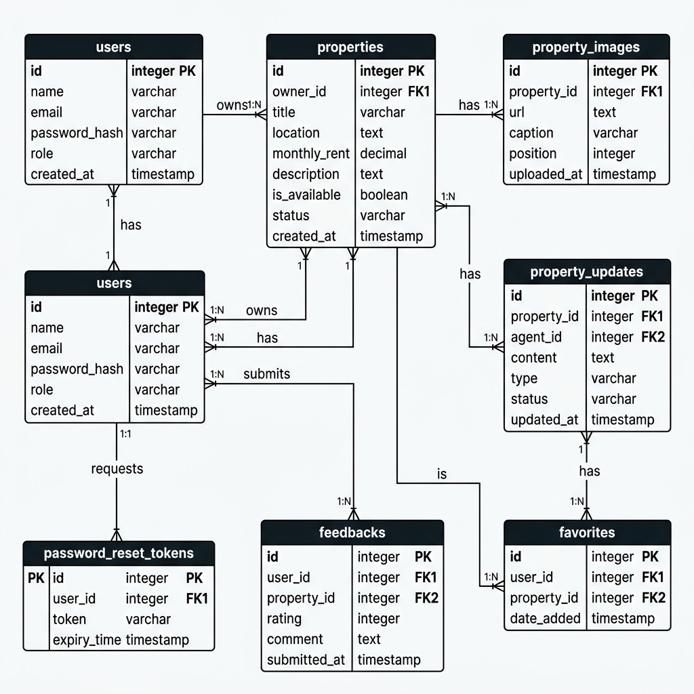
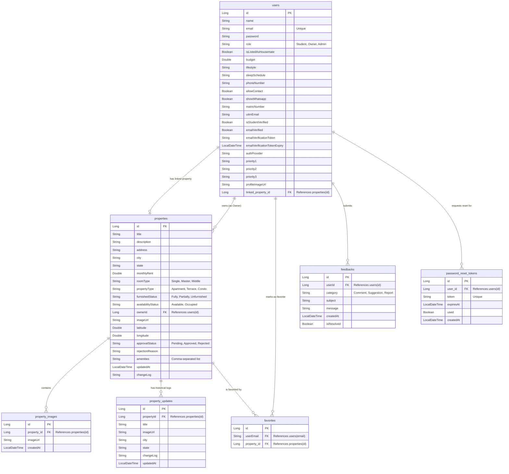

# Entity-Relationship Diagram (ERD) - RakanSewa Database Schema

Below is the database Entity-Relationship Diagram (ERD) for the **RakanSewa** system. It details the database tables, field data types, primary/foreign keys, and relational linkages.

## 1. Visual Schema Diagram

---

## 2. Interactive Mermaid ERD

Use this Mermaid diagram to view relationships and copy structure for database design or schema setups:

---

## 3. Entity Definitions & Attribute Details

### A. `users` Table
Stores authentication and profile information for Students, Property Owners, and System Administrators.
- **`id` (PK)**: Auto-incremented unique identifier.
- **`linked_property_id` (FK)**: References the `properties` table. Represents the housemate's linked rental house.
- **`email`**: Unique user email address.
- **`role`**: Characterizes user permissions (`Student`, `Owner`, `Admin`).
- **Priorities (`priority1`, `priority2`, `priority3`)**: Student-matching criteria used in compatibility score calculation.

### B. `properties` Table
Houses all off-campus student accommodation listings.
- **`id` (PK)**: Auto-incremented unique identifier.
- **`ownerId` (FK)**: Implicit relationship pointing to `users(id)` representing the listing's landlord.
- **`approvalStatus`**: Flow control attribute (`Pending`, `Approved`, `Rejected`). New properties require admin approval.
- **`amenities`**: Stored as a comma-separated list of selected property characteristics.

### C. `property_images` Table
Holds additional gallery image assets uploaded for rental properties.
- **`id` (PK)**: Auto-incremented unique identifier.
- **`property_id` (FK)**: Cascade-deletable foreign key referencing `properties(id)`.

### D. `property_updates` Table
A historical logging table recording listing modifications. Every edit to an approved listing generates a new row in this table to preserve change logs sequentially.
- **`id` (PK)**: Auto-incremented unique identifier.
- **`propertyId` (FK)**: Relates conceptually to `properties(id)`.

### E. `favorites` Table
Tracks user bookmarking interactions.
- **`id` (PK)**: Auto-incremented unique identifier.
- **`property_id` (FK)**: References `properties(id)`.
- **`userEmail`**: References `users(email)`.

### F. `feedbacks` Table
Captures user comments, feature suggestions, or issue reports.
- **`id` (PK)**: Auto-incremented unique identifier.
- **`userId` (FK)**: References `users(id)`.
- **`category`**: Triage type (`Comment`, `Suggestion`, `Report`).

### G. `password_reset_tokens` Table
Manages secure password recovery tokens.
- **`id` (PK)**: Auto-incremented unique identifier.
- **`user_id` (FK)**: References `users(id)`.
