# Package Diagram - RakanSewa

Below is the **Package Diagram** for the **RakanSewa** system. It models the directory and package layout, demonstrating dependencies between the frontend UI component views, backend REST controllers and service components, and the database access layers.

## 1. Mermaid Package Diagram

```mermaid
flowchart TB
    subgraph ViewLayer ["View Layer (Web Application)"]
        LoginPage["LoginPage"]
        RegisterPage["RegisterPage"]
        ForgotPasswordPage["ForgotPasswordPage"]
        PropertyDetailsPage["PropertyDetailsPage"]
        FeedbackPage["FeedbackPage"]
        AdminDashboardPage["AdminDashboardPage"]
        OwnerDashboardPage["OwnerDashboardPage"]
        HousemateMatchingPage["HousemateMatchingPage"]
    end

    subgraph DomainLayer ["Domain Layer (Web Application)"]
        subgraph Controllers ["Controllers"]
            AuthController["AuthController"]
            PropertyController["PropertyController"]
            AdminPropertyController["AdminPropertyController"]
            MatchingController["MatchingController"]
            FeedbackController["FeedbackController"]
            FavoriteController["FavoriteController"]
            UserController["UserController"]
        end
        subgraph Services ["Services"]
            UserService["UserService"]
            PropertyService["PropertyService"]
            MatchingService["MatchingService"]
            FeedbackService["FeedbackService"]
            FavoriteService["FavoriteService"]
            PasswordResetService["PasswordResetService"]
            EmailService["EmailService"]
        end
    end

    subgraph DataAccessLayer ["Data Access Layer"]
        subgraph Repositories ["Repositories"]
            UserRepository["UserRepository"]
            PropertyRepository["PropertyRepository"]
            FeedbackRepository["FeedbackRepository"]
            FavoriteRepository["FavoriteRepository"]
            PropertyImageRepository["PropertyImageRepository"]
            PropertyUpdateRepository["PropertyUpdateRepository"]
            PasswordResetTokenRepository["PasswordResetTokenRepository"]
        end
        subgraph Entities ["Entities"]
            User["User"]
            Property["Property"]
            PropertyImage["PropertyImage"]
            PropertyUpdate["PropertyUpdate"]
            Favorite["Favorite"]
            Feedback["Feedback"]
            PasswordResetToken["PasswordResetToken"]
        end
    end

    %% Dependency Arrows (Views -> Controllers)
    LoginPage -.-> AuthController
    RegisterPage -.-> AuthController
    ForgotPasswordPage -.-> AuthController
    PropertyDetailsPage -.-> PropertyController
    PropertyDetailsPage -.-> FavoriteController
    OwnerDashboardPage -.-> PropertyController
    AdminDashboardPage -.-> AdminPropertyController
    AdminDashboardPage -.-> FeedbackController
    FeedbackPage -.-> FeedbackController
    HousemateMatchingPage -.-> MatchingController

    %% Dependency Arrows (Controllers -> Services)
    AuthController -.-> UserService
    AuthController -.-> PasswordResetService
    PropertyController -.-> PropertyService
    AdminPropertyController -.-> PropertyService
    MatchingController -.-> MatchingService
    FeedbackController -.-> FeedbackService
    FavoriteController -.-> FavoriteService
    UserController -.-> UserService

    %% Dependency Arrows (Services -> Repositories)
    UserService -.-> UserRepository
    UserService -.-> PasswordResetTokenRepository
    PropertyService -.-> PropertyRepository
    PropertyService -.-> PropertyImageRepository
    MatchingService -.-> UserRepository
    FeedbackService -.-> FeedbackRepository
    FavoriteService -.-> FavoriteRepository
    PasswordResetService -.-> PasswordResetTokenRepository
    PasswordResetService -.-> EmailService

    %% Dependency Arrows (Repositories -> Entities)
    UserRepository -.-> User
    PropertyRepository -.-> Property
    PropertyImageRepository -.-> PropertyImage
    FeedbackRepository -.-> Feedback
    FavoriteRepository -.-> Favorite
    PropertyUpdateRepository -.-> PropertyUpdate
    PasswordResetTokenRepository -.-> PasswordResetToken
```

---

## 2. Layer Descriptions

### A. View Layer (Web Application)
- **Purpose**: React frontend client views responsible for gathering inputs and presenting property and compatibility data.
- **Component Dependencies**: Pages depend on the backend REST controllers by making asynchronous Axios/fetch HTTP calls to trigger CRUD operations or fetch data.

### B. Domain Layer (Web Application)
- **Controllers Package**: Houses the Spring Boot RestControllers. They parse request payloads, manage routes, and delegate business orchestration to the Service package.
- **Services Package**: Contains business services. They implement logical criteria (e.g., compatibility matching score algorithms) and manage database transaction scopes.

### C. Data Access Layer
- **Repositories Package**: Spring Data JPA repository interfaces which abstract SQL/H2 database operations (e.g., query methods).
- **Entities Package**: Domain entity models representing tables in the database schema.
