# Multilayer Sequence Diagrams - RakanSewa Use Cases

This document provides the **UML Multilayer Sequence Diagrams** for all 14 use cases of the **RakanSewa** system. Each diagram includes the Actor, Views (`<<View>>`), Controllers (`<<Controller>>`), Domain Entities (`<<Domain>>`), and Data Access/Repositories (`DA: Repository`), including lifelines and detailed messages.

---

## 1. Create Account
Student/Owner creates a new account.

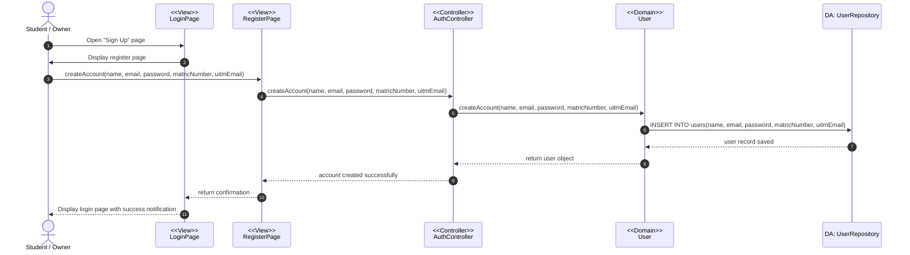

---

## 2. View Account
User views their profile details.

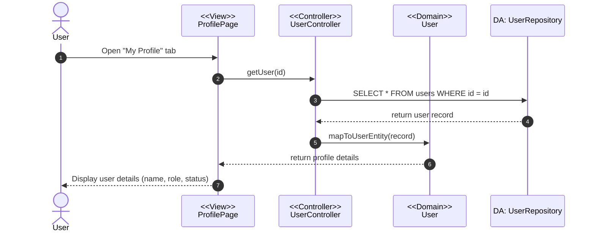

---

## 3. Update Account
User updates contact profile details.

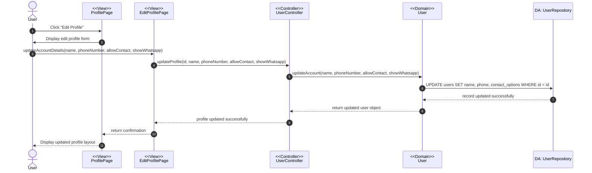

---

## 4. Update Housemate Profile
Student updates matching scheduler priorities.

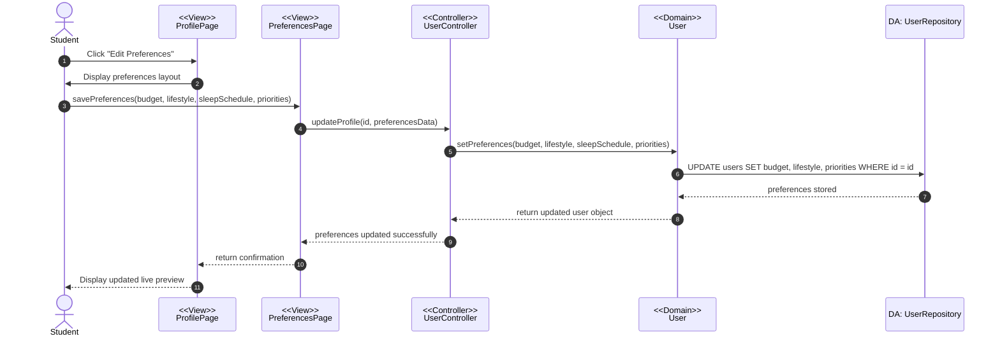

---

## 5. View Housemates Listing
Student browses housemates compatibility listing.

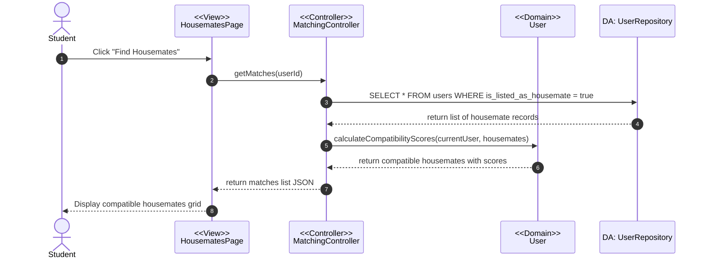

---

## 6. Filter Properties
Student applies parameters to filter listings.

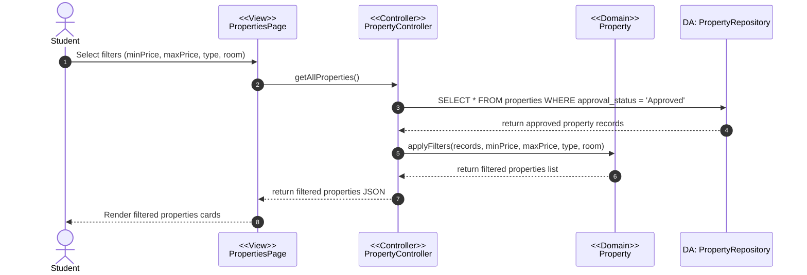

---

## 7. Submit Feedback
Student or Owner submits feedback request.

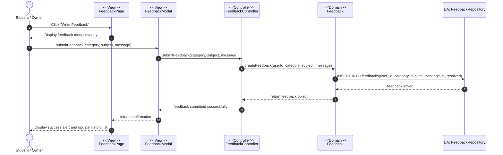

---

## 8. Create Property Listing
Owner creates a listing (pending moderation).

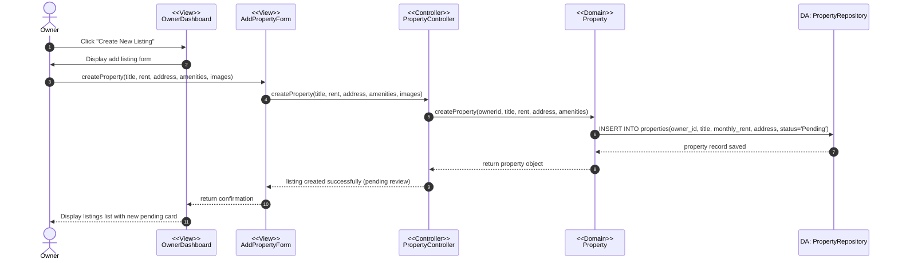

---

## 9. View Property Listing
User views listing details.

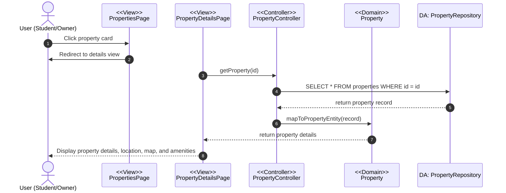

---

## 10. Update Property Listing
Owner modifies details of their listed property.

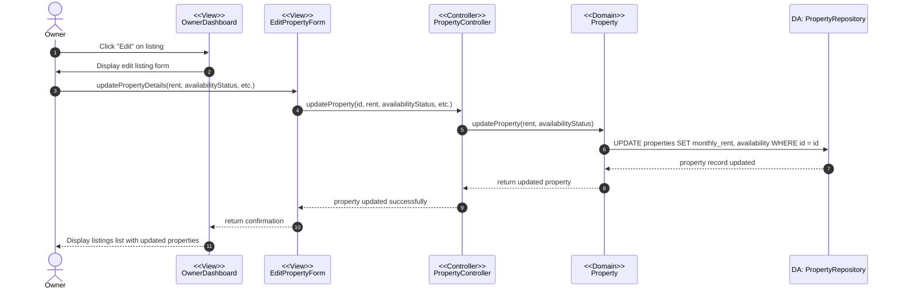

---

## 11. Delete Property Listing
Owner deletes listing from their catalog.

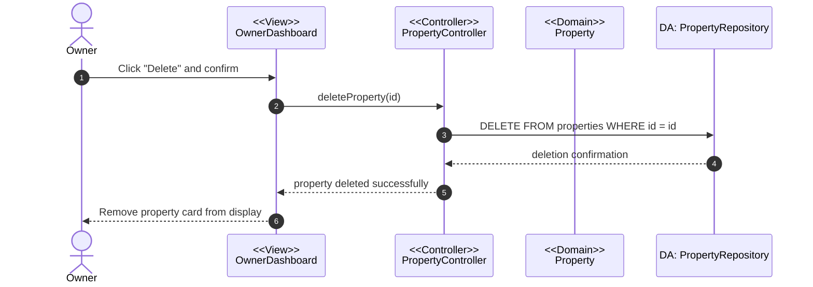

---

## 12. Verify Property Listing
Admin approves or rejects a property listing.

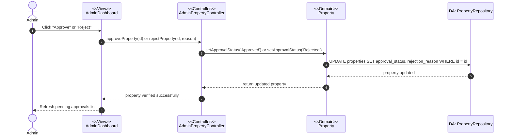

---

## 13. View Feedbacks
Admin retrieves all submitted feedbacks.

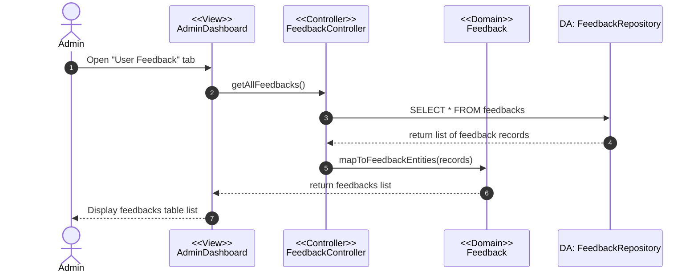

---

## 14. Approve Feedback (Resolve Feedback)
Admin flags unresolved feedback cases as resolved.

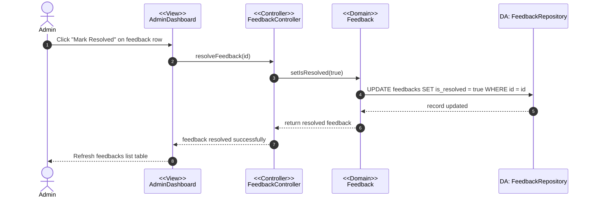
