# Detailed Class Diagrams - RakanSewa Use Cases

This document provides the **UML Detailed Class Diagrams** for the remaining 13 use cases of the **RakanSewa** system. Each diagram includes View (`<<View>>`), Controller (`<<Controller>>`), Entity (`<<Entity>>`), and Repository/DAO (`<<DAO>>`) classes, including operations, fields, and dependencies.

---

## Use Case 1: View Account
Student, Owner, or Admin loads their user profile details.

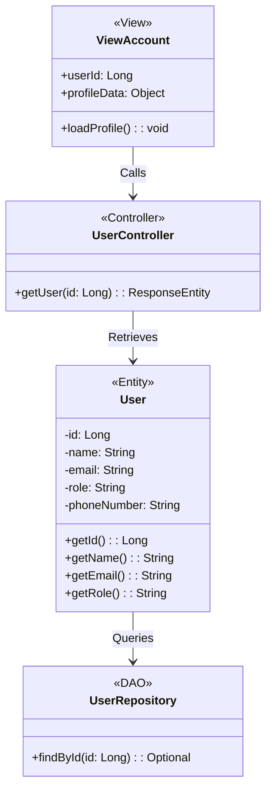

---

## Use Case 2: Update Account
User updates their primary contact details and visibility preferences.

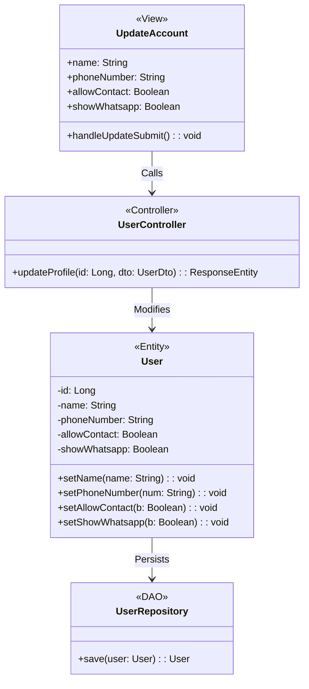

---

## Use Case 3: Update Housemate Profile
Student sets compatibility budget, schedules, and matching priority rankings.

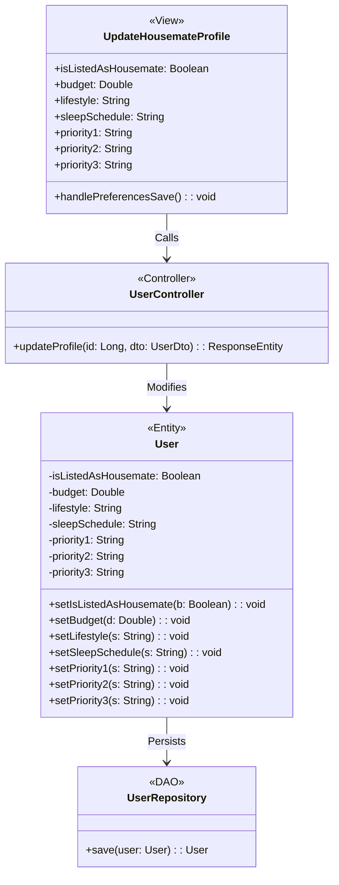

---

## Use Case 4: View Housemates Listing
Student browses matches and views calculated compatibility scores.

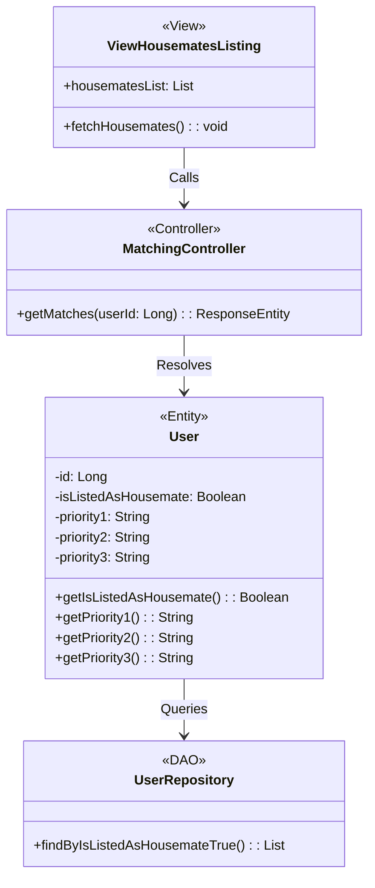

---

## Use Case 5: Filter Properties
Student applies query filters (price, room type, property type) to listings.

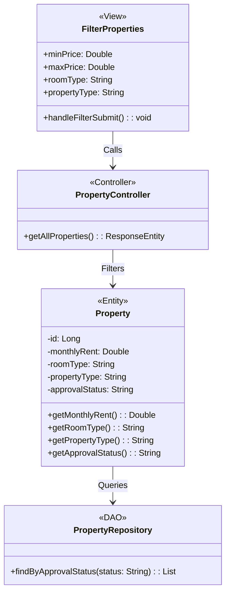

---

## Use Case 6: Submit Feedback
Student or Owner drafts and uploads feedback comments, suggestions, or reports.

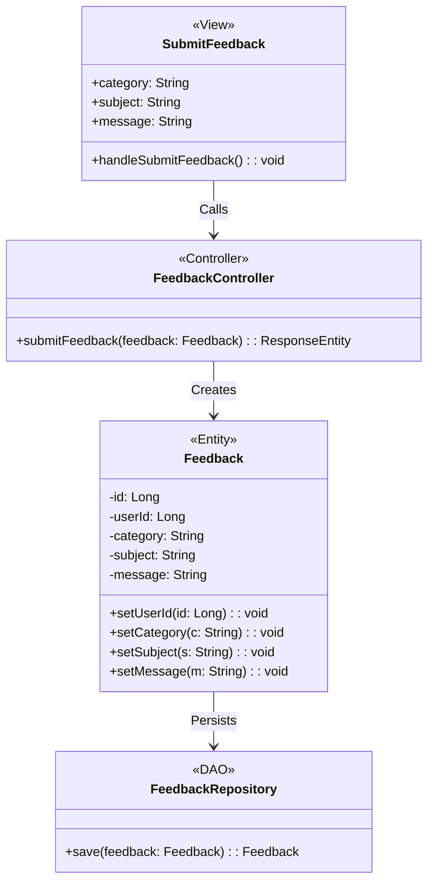

---

## Use Case 7: Create Property Listing
Owner uploads description, rent pricing, and parameters to list their rental.

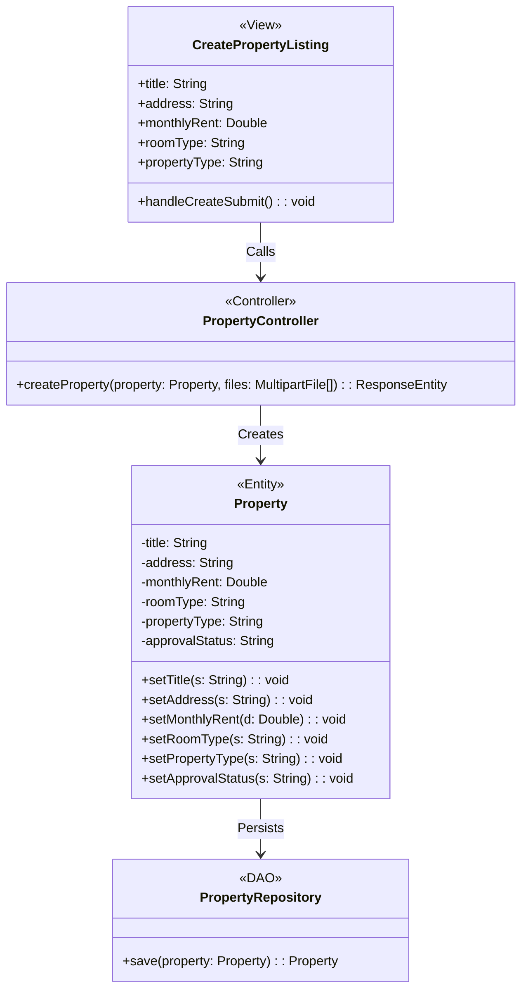

---

## Use Case 8: View Property Listing
Student or Owner reads detail parameters, location distance, and gallery updates.

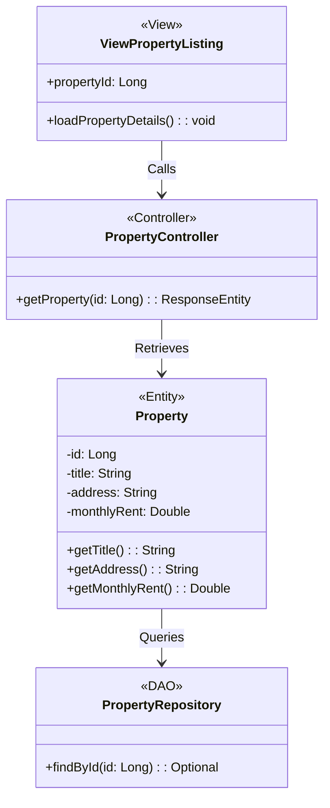

---

## Use Case 9: Update Property Listing
Owner modifies parameters of their accommodation and registers changes.

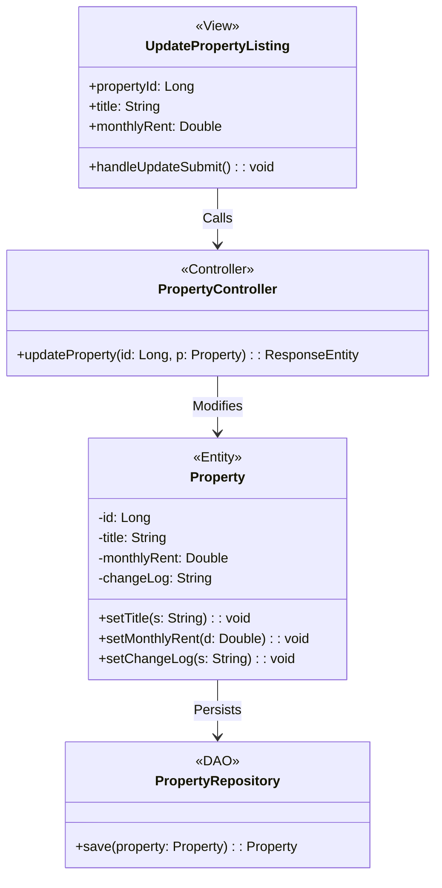

---

## Use Case 10: Delete Property Listing
Owner removes their off-campus listing permanently from the system.

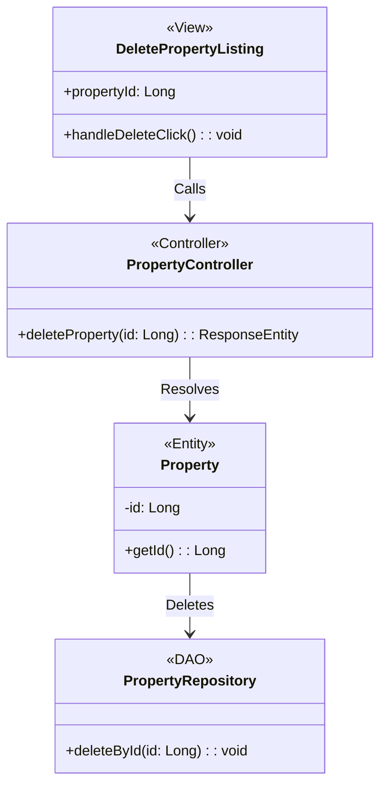

---

## Use Case 11: Verify Property Listing
Admin reviews, rejects (with reasons), or approves pending rental listings.

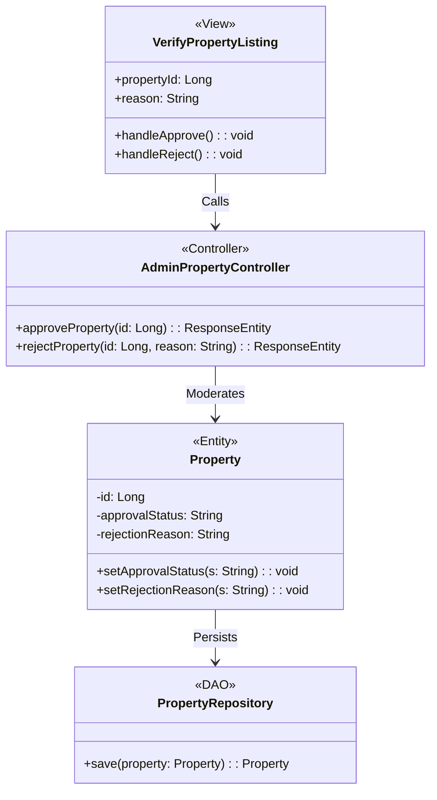

---

## Use Case 12: View Feedbacks
Admin views unresolved or categorized feedback logs in the system.

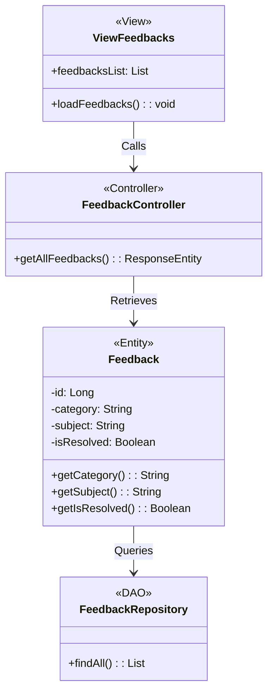

---

## Use Case 13: Approve Feedback (Resolve Feedback)
Admin flags unresolved feedback cases as resolved.

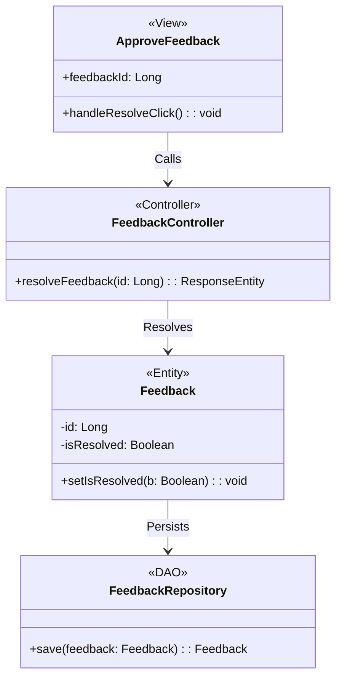
